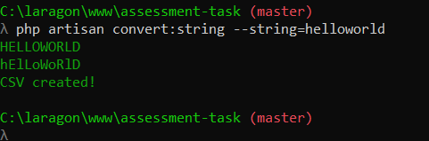
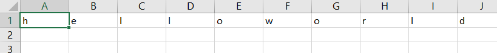

#Basic String Converter Program

To convert a string, run terminal and the type command `php artisan convert:string --string=type-any-string-here`

The result will be as follow

- CAPITALCASES
- alternate capital cases
- csv file output.csv on root

